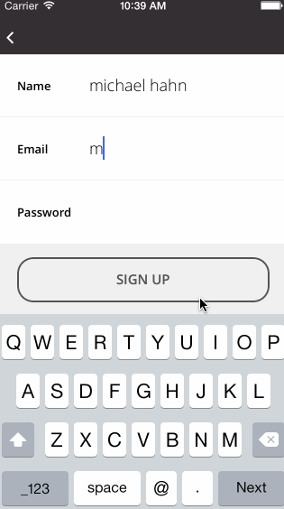

# Goalie (iOS)
Goalie is a mobile application that enables [Mission Asset Fund](http://missionassetfund.org/) (MAF) [Lending Circle](http://missionassetfund.org/lending-circles/) participants to: 

- Easily monitor their loan status, including payments in real-time.
- Monitor and input savings and spendings.
- Create short and long term budget goals.
- Receive notifications from MAF staff if there are any payment issues or program updates.

## Walkthrough


## Screenshots

## Team

### Devs
- Michael Hahn ([@mhahn](http://github.com/mhahn))
- Eddie Freeman ([@ninjasudo](http://github.com/ninjasudo))
- Guy Morita ([@guymortia](http://github.com/guymorita))

### Designers
- Jairo Avalos ([@jairoavalos](http://github.com/jairoavalos))
- Tom Gurka ([@tomgurka](http://github.com/tomgurka))

## Setup Instructions
* **Clone the repository**

`git clone https://github.com/CodePath-MAF/iOSClient.git`

* **Create the config file**

Create `Utilities/ServicesConfig.plist` and add in the Parse Application & Client ID for the project following this sample:

```xml
<?xml version="1.0" encoding="UTF-8"?>
<!DOCTYPE plist PUBLIC "-//Apple//DTD PLIST 1.0//EN" "http://www.apple.com/DTDs/PropertyList-1.0.dtd">
<plist version="1.0">
<dict>
	<key>PARSE_CLIENT_ID</key>
	<string>**ENTER YOUR CLIENT_ID HERE**</string>
	<key>PARSE_APP_ID</key>
	<string>**YOUR PARSE_APP_ID HERE**</string>
	<key>CRITTERCISM_APP_ID</key>
	<string>**YOUR CRITTERCISM_APP_ID HERE**</string>
</dict>
</plist>
```

**Note:** This config file will be gitginore.

* **Import Third-party Libraries**

Install Pods (from XCode project root): 'pod install'

## Third-party Libraries

Below we have the list of third-party libraries used on the app:

- [Parse SDK](https://parse.com/docs/ios_guide): responsible for doing the data synchronization between the app and remote server
- PNCharts
- POP
- MHPrettyDate
- Bolts
- MRProgress

## License

All code is distributed under MIT license. See LICENSE file for more information.

## Contributing

Please fork this repository and contribute back using [pull requests](https://github.com/CodePath-MAF/AndroidClient/pulls).

Any contributions, large or small, major features, bug fixes, additional language translations, unit/integration tests are welcomed and appreciated but will be thoroughly reviewed and discussed.
